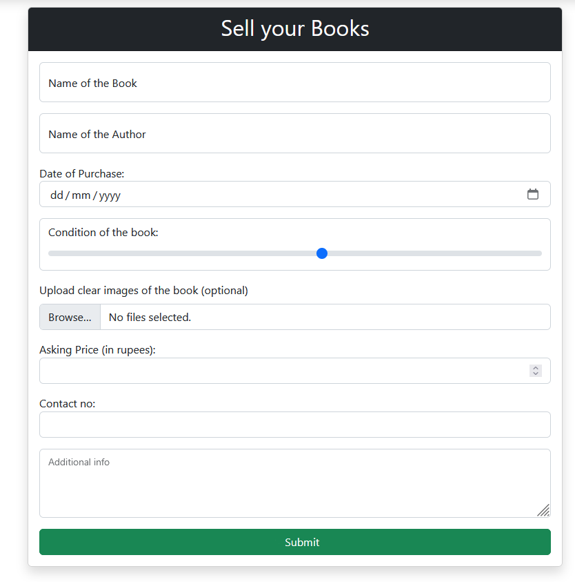
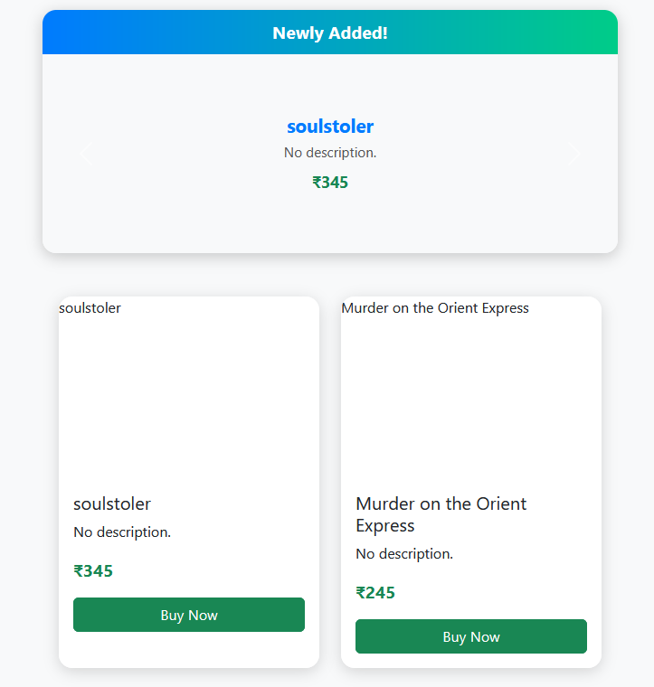

# 📚 Sell N Buy Books

A modern **web application for buying and selling second-hand books**. Users can register, list books, browse available books, purchase them, and manage their account seamlessly. Perfect for students and book enthusiasts!

---

## 🌐 Live Demo

Check out the live application here: [SellNBuyBooks](https://sellnbuybooks.onrender.com/)

---

## 🎯 Features

- ✅ **User Authentication:** Secure registration and login system  
- ✅ **Book Listings:** Add, edit, and delete your book listings  
- ✅ **Search and Browse:** Search books by title, author, or category  
- ✅ **Purchase & Sales History:** Track all your transactions  
- ✅ **Account Management:** View and update personal info  
- ✅ **Responsive Design:** Works on desktop and mobile devices  

---

## 🖼 Screenshots

  
*Homepage showcasing featured books.*

  
*Form for adding new book listings.*

  
*Page which displays the listed books. Available to buy.*

---

## 🛠 Technology Stack

- **Frontend:** HTML, CSS, JavaScript  
- **Backend:** JavaScript *(Node)*
- **Database:** MongoDB  
- **Authentication:** Secure password hashing & session management  

---

## 🚀 Future Improvements

- 🔹 Payment gateway integration for secure online transactions  
- 🔹 Ratings and reviews for buyers and sellers  
- 🔹 Real-time chat between buyers and sellers  
- 🔹 Advanced search and filtering for easier navigation  
- 🔹 Optimized deployment for better performance and scalability  

---

## 📄 License

This project is licensed under the MIT License.

---

## 💬 Contact

For any questions or feedback, feel free to reach out via email: `sanmitra.mukherjee15@.com`  
Or open an issue on the GitHub repository.
